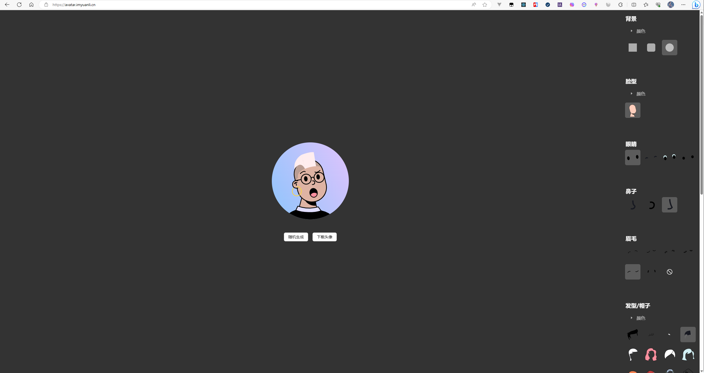

<div align="center">
<h1>Avatar-craft</h1>

**Avatar craft, implemented with React, can quickly create your own exquisite avatar.**

[Preview Demo](https://avatar.imyuanli.cn/) / [反馈 Issues](https://github.com/imyuanli/avatar-craft/issues)

[](https://vercel.com/new/clone?repository-url=https://github.com/imyuanli/avatar-craft.git&project-name=avatar-craft&repository-name=avatar-craft)

<a href="https://avatar.imyuanli.cn">
  
</a>

</div>

## Develop

This project is built with `Umi` + `tailwindcss` + `Antd`.

```sh
# 1. Clone project
git clone https://github.com/imyuanli/avatar-craft.git

# 2. Install dependencies
yarn install

# 3. Run
yarn dev
```

## Assets

> **Note**  
> The project's avatar related materials come from the Figma community [Avatar Illustration System](https://www.figma.com/community/file/829741575478342595) by Micah Lanier.

Inspired by - [vue-color-avatar](https://github.com/Codennnn/vue-color-avatar)


## License

[MIT](https://choosealicense.com/licenses/mit/)


###### README.md powered by [RMX](https://readme.imyuanli.cn)


